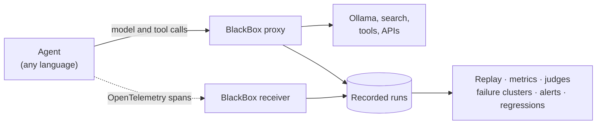

# BlackBox

A flight recorder for AI agents. BlackBox records every run of an agent, including each model call and tool call,
so you can replay any run exactly, or re-run it from any step with another model or prompt. It scores runs, groups
similar failures with a likely cause, alerts you when live quality drops, and (next) runs a regression suite in CI.
It runs entirely on local models (Ollama).

> **Status:** phases 0–9 of 12 are built: capture, proxy, replay and forks, judges, the OpsDesk test agent, metrics,
> failure clusters and live alerts. All of it is tested against fake models and agents (177 tests, CI green). It has
> not yet run against a real Ollama or PaperPilot: the phase 0 spikes S1–S3 and each phase's live "Done when" checks
> are still open. Phase 10 (regression suites and CI) and phase 11 (the challenge) come next. The
> [plan](docs/plan/README.md) records what each phase built and what is left.

## What it does

- **Records** agent runs live: OpenTelemetry spans (GenAI conventions) plus the exact bytes of every model and tool
  response, streaming included. Secrets (`Authorization`, API keys, cookies) are stripped before anything is stored.
- **Replays** any recorded run exactly, with no model calls. **Forks** it from step N with another model or a
  changed prompt. After a code change, **auto-fork** reuses the recording until the agent's requests first differ,
  so only the affected steps call the model. Stateful tools replay too, with identifier aliasing. Every replay gets a
  fidelity report.
- **Measures** each run: wrong tool chosen, loops, recovery after errors, repeated and invalid calls, wasted steps,
  tokens and latency.
- **Judges** runs with LLM judges and measures how often each judge agrees with your own blind labels (Cohen's κ).
  Only judges that pass the agreement gate are trusted to decide failures and alerts.
- **Groups failures** automatically (embeddings and HDBSCAN) and names a likely cause for each group. Evidence is
  checked against the real runs and steps.
- **Alerts** within minutes when the quality of live runs drops. Alerts show as a banner on every page and can go
  to Telegram. They name the signal that dropped, the failure clusters behind it and any change you marked on the
  timeline.
- **Catches regressions** *(phase 10, not built yet)*: a suite compares a changed agent against a recorded baseline
  and gives a statistical verdict. In CI it runs on replay alone, without a model.

## How it works



BlackBox sits on the network between an agent and its model and tools, so it works with agents written in any
language. The agent's calls go through BlackBox's proxy, which stores every response together with the `traceparent`
the call carried. The agent's spans show which step made each call. To replay a run, the proxy answers the agent from
the recording instead of calling the real services.

Everything runs in one process, `blackbox serve`, bound to `127.0.0.1`:

| Port | What |
|---|---|
| 8200 | Web UI, REST API (`/api/docs`), OTLP/HTTP receiver (`/v1/traces`), server-sent events |
| 8210 | Proxy to Ollama (`127.0.0.1:11434`) |
| 8211 | Proxy to PaperPilot's OpenSearch |
| 8212 | Proxy to Jina |
| 8213 | Proxy to the OpsDesk environment (stateful) |

Runs are stored in one SQLite file (`data/blackbox.db`). A background worker computes metrics, runs judges,
clusters failures and evaluates the alert detectors.

## Quick start

You need [uv](https://docs.astral.sh/uv/) (it installs Python 3.14) and [Ollama](https://ollama.com) with
`qwen3.5:4b`.

```bash
git clone https://github.com/arunmariappan/BlackBox && cd BlackBox
uv sync
ollama pull qwen3.5:4b
uv run blackbox serve                     # http://127.0.0.1:8200
```

Record and replay a run of OpsDesk, the test agent in this repo (each in its own terminal):

```bash
uv run opsdesk env                        # the simulated IT ops desk, :8221
uv run opsdesk agent                      # the agent, :8220 (its calls go through the proxy)
uv run blackbox run opsdesk --task fix-01-bad-deploy
uv run blackbox replay <run>              # exact replay from the recording, no model calls
uv run blackbox replay <run> --from-step 3 --model qwen3.5:4b   # fork: recorded before step 3, live after
uv run blackbox replay <run> --auto-fork --patch patch.yaml     # a prompt change: live only where requests differ
```

Open the run in the UI to see its timeline, each step's exact request and response, its metrics, and the replay's
fidelity report.

## Connecting your own agent

1. Point the agent's model and tool base URLs at proxy listeners (add an `[[proxy.upstreams]]` entry in
   `blackbox.toml` for each service).
2. Export OpenTelemetry traces over OTLP/HTTP to `http://127.0.0.1:8200/v1/traces`, and propagate W3C `traceparent`
   on outgoing calls.
3. Python agents can use the small SDK instead of hand-written OpenTelemetry code:

   ```python
   from blackbox import sdk

   sdk.init(service_name="my-agent", endpoint="http://127.0.0.1:8200")
   with sdk.agent_run("my-agent", input=request, headers=incoming_headers) as run:
       response = sdk.traced_chat(ollama_client, model="qwen3.5:4b", messages=messages, tools=tools)
       run.set_output(answer)
   ```

4. Add a profile in `src/blackbox/profiles/`, one Python module per agent. It says how to start a run, which spans
   are steps, how to read the output and ending, and which metrics and judges apply.

## Commands

```bash
uv run blackbox serve                                   # UI, API, OTLP receiver, proxy listeners, worker
uv run blackbox run paperpilot "What are transformer architectures?"   # a recorded run
uv run blackbox run opsdesk --all-tasks --repeats 2     # every OpsDesk task (asks before long GPU batches)
uv run blackbox runs list | show | export | import      # run bundles: run.json + blobs/
uv run blackbox replay <run> [--from-step N | --auto-fork] [--model M] [--patch FILE]
uv run blackbox judge run | calibrate | stability | sensitivity
uv run blackbox labels export                           # your blind labels
uv run blackbox metrics recompute [--profile P]
uv run blackbox cluster --profile opsdesk               # re-cluster failures now
uv run blackbox traffic paperpilot --rate 1/min --max-runs 30   # live runs on demand, capped
uv run blackbox live-patch add patch.yaml --minutes 30  # a deliberate break on live traffic, expires by itself
uv run blackbox mark paperpilot "new guardrail prompt"  # a marker on the timeline, shown in charts and alerts
uv run blackbox db upgrade | prune --older-than 30d
```

The UI has pages for runs (timeline, steps, exact exchanges), live scoring, alerts, an overview with charts,
failure clusters, replays, judges, blind labelling, unattributed calls and background jobs.

## Configuration

`blackbox.toml` holds ports, proxy upstreams and header redaction, run assembly, judges, clustering, live sampling
and alert rules. Any value can be overridden with an environment variable such as `BLACKBOX__SERVER__PORT=8300`.
Secrets go in `.env` (see `.env.example`), for example the Telegram bot token and chat id for alerts.

## Test agents

- **[PaperPilot](https://github.com/arunmariappan/PaperPilot)**, an agentic RAG over arXiv papers written in .NET.
  An opt-in `BlackBox:Enabled` switch sends its traces to BlackBox and its calls through the proxy (to be added to
  PaperPilot on the PC where it runs).
- **OpsDesk** (`src/opsdesk/`), a small Python tool-calling agent for a simulated IT ops desk, built in this repo.
  Its 25 tasks are checked automatically against the final state and five policies, which gives ground truth for
  the metrics and judges. It talks to BlackBox only through the proxy and OTLP, like any outside agent.

## Development

```bash
uv run ruff format --check && uv run ruff check
uv run mypy                               # strict on src/
uv run pytest                             # unit and integration tests; no Ollama or GPU needed
```

Integration tests start a whole BlackBox in-process with fake models and agents. GitHub Actions runs the same checks
on every push.

```
src/blackbox/     store · otlp · runs · proxy · replay · judges · metrics · clusters · live · profiles · sdk · web
src/opsdesk/      the OpsDesk environment, agent and tasks
datasets/         question sets (PaperPilot)
docs/plan/        decisions, architecture and the twelve phases
tests/            unit and integration tests
```

## Stack

Python 3.14 with uv · FastAPI, Jinja2 and HTMX (no hand-written JavaScript) · SQLite with SQLAlchemy and Alembic ·
OpenTelemetry · Ollama with `qwen3.5:4b` · Plotly · scikit-learn and fastembed for failure clustering.

## Plan

[docs/plan/](docs/plan/README.md) has the decisions, the architecture and twelve phases, from bootstrap to the final
challenge: break an agent on purpose with a small prompt change, and have BlackBox catch the regression and name the
cause automatically. Each phase file ends with what was actually built.

| Phase | | Status |
|---|---|---|
| 0 | Bootstrap, tooling, CI | Built; spikes S1–S3 need the PC with Ollama and PaperPilot |
| 1 | Store, blobs, run bundles | Built |
| 2 | OTLP capture, run assembly, SDK, UI | Built |
| 3 | Recording proxy | Built |
| 4 | Replay, forks, auto-fork, patches | Built |
| 5 | Judges, blind labels, agreement | Built; calibration needs your labels |
| 6 | OpsDesk agent and stateful replay | Built |
| 7 | Run metrics | Built |
| 8 | Failure clusters | Built; checking on real failures needs the GPU |
| 9 | Live scoring and alerts | Built; live checks need the GPU |
| 10 | Regression suites and CI | Next |
| 11 | Challenge, docs, hardening | Planned |

## License

[Apache-2.0](LICENSE)
