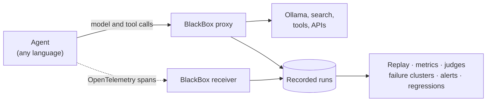

# BlackBox

A flight recorder for AI agents. BlackBox records every run of an agent, including each model call and tool call,
so you can replay any run exactly, or re-run it from any step with another model or prompt. It scores runs, groups
similar failures with a likely cause, alerts you when live quality drops, and runs a regression suite in CI. It runs
entirely on local models (Ollama).

> **Status:** in development. The [implementation plan](docs/plan/README.md) is written; the code comes next,
> phase by phase.

## What it does

- **Records** agent runs live: OpenTelemetry spans (GenAI conventions) plus the exact bytes of every model and tool
  response.
- **Replays** any recorded run exactly. **Forks** it from step N with another model or a changed prompt. After a code
  change, **auto-fork** reuses the recording until the agent's requests first differ, so only the affected steps
  call the model.
- **Measures** each run: wrong tool chosen, loops, recovery after errors, wasted steps, tokens and latency.
- **Judges** runs with LLM judges, and measures how often each judge agrees with your own labels. Only judges that
  pass an agreement check are trusted.
- **Groups failures** automatically and names a likely cause for each group, with links to the evidence.
- **Alerts** within minutes when the quality of live runs drops.
- **Catches regressions:** a suite compares a changed agent against a recorded baseline and gives a statistical
  verdict. In CI it runs on replay alone, without a model.

## How it works

BlackBox sits on the network between an agent and its model and tools, so it works with agents written in any
language. The agent's calls go through BlackBox's proxy, which stores every response. The agent's spans show which
step made each call. To replay a run, the proxy answers the agent from the recording instead of calling the real
services.

## Test agents

- **[PaperPilot](https://github.com/arunmariappan/PaperPilot)**, an agentic RAG over arXiv papers written in .NET.
  An opt-in `BlackBox:Enabled` switch sends its calls through the proxy.
- **OpsDesk**, a small Python tool-calling agent for a simulated IT ops desk, built in this repo. Its 25 tasks are
  checked automatically, which gives ground truth for the metrics and judges.

## Stack

Python 3.14 with uv · FastAPI, Jinja2 and HTMX · SQLite · OpenTelemetry · Ollama with `qwen3.5:4b` · scikit-learn
and fastembed for failure clustering.

## Plan

[docs/plan/](docs/plan/README.md) has the decisions, the architecture and twelve phases, from bootstrap to the final
challenge: break an agent on purpose with a small prompt change, and have BlackBox catch the regression and name the
cause automatically.

## License

[Apache-2.0](LICENSE)
