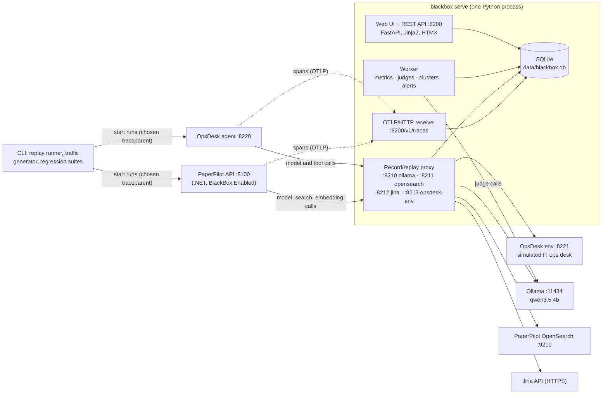

# BlackBox: implementation plan

BlackBox is a flight recorder for AI agents. It records every run of an agent, including each model call and tool
call, so that any run can be replayed exactly, or re-run from any step with another model or prompt. It scores runs
with deterministic metrics and with LLM judges whose agreement with your own labels is measured. It groups similar
failures and names a likely cause for each group. It alerts within minutes when the quality of live runs drops, and
its regression suite runs in CI.

BlackBox is written in Python, but it works with agents written in any language. It sits on the network between an
agent and its model and tools, and it receives the agent's OpenTelemetry traces. It is tested on two agents:
PaperPilot's agentic RAG (.NET) and OpsDesk, a small Python agent for a simulated IT ops desk, built in this repo for
testing.

> **Status (2026-10-05):** plan written and waiting for review. No code yet.

| File | What it covers |
|---|---|
| [README.md](README.md) | Decisions, architecture, repo layout, packages, configuration, conventions, phases, risks, definition of done |
| [phase-0-bootstrap.md](phase-0-bootstrap.md) | Repo, tooling, CI skeleton, and four spikes that check the riskiest assumptions |
| [phase-1-store.md](phase-1-store.md) | Data model, SQLite store, blob storage, run bundles |
| [phase-2-capture.md](phase-2-capture.md) | OTLP receiver, GenAI span normalisation, run assembly, Python SDK, first UI pages |
| [phase-3-proxy.md](phase-3-proxy.md) | Recording proxy, PaperPilot's opt-in BlackBox switch |
| [phase-4-replay.md](phase-4-replay.md) | Exact replay, fork from step N, model override, prompt patches, auto-fork |
| [phase-5-judges.md](phase-5-judges.md) | LLM judges, blind labelling, agreement statistics. **The MVP is complete here.** |
| [phase-6-opsdesk.md](phase-6-opsdesk.md) | OpsDesk agent, simulated environment and 25 tasks; replay of stateful tools |
| [phase-7-metrics.md](phase-7-metrics.md) | Run metrics: wrong tool, loops, recovery after errors, wasted steps |
| [phase-8-failure-clusters.md](phase-8-failure-clusters.md) | Grouping similar failures, naming a likely cause |
| [phase-9-live-scoring.md](phase-9-live-scoring.md) | Sampling and scoring live runs, drop detection, alerts, traffic generator |
| [phase-10-regression-ci.md](phase-10-regression-ci.md) | Regression suites, baseline against candidate statistics, GitHub Actions |
| [phase-11-challenge.md](phase-11-challenge.md) | Planted regressions with automatic cause naming; docs and hardening |

---

## 1. Decisions

D3, D4, D5 and D10 were chosen by you on 2026-10-05. The others are recommendations; change any of them here during
review.

| # | Decision | Choice | Notes |
|---|---|---|---|
| D1 | Language | **Python 3.14 only**, managed with `uv` | Both are installed (Python 3.14.7, uv 0.12). The UI is HTML templates plus HTMX; no JavaScript is written. If a dependency has no 3.14 wheel when phase 0 checks, use 3.13 instead. |
| D2 | Repo | **`github.com/arunmariappan/BlackBox`**, cloned at `D:\ai_workspace\BlackBox` | Public, Apache-2.0 (`LICENSE` came with the repo). Work on `main`, one small conventional commit per task, pushed. Repo-local noreply identity. Commit messages have no attribution trailer. |
| D3 | Capture and replay | **Record/replay HTTP proxy + OTLP receiver** | The proxy stores the exact bytes of every model and tool call and can answer from them later. The OTLP receiver collects the span tree, which tells which agent step made each call. Together they work for agents in any language. |
| D4 | PaperPilot | **A small opt-in switch in PaperPilot**, `BlackBox:Enabled` (off by default) | When it's on, ServiceDefaults adds a trace exporter to BlackBox (phase 2) and the AppHost sends the API's Ollama, OpenSearch and Jina calls through the proxy (phase 3). The worker and ingestion are untouched. PaperPilot's default model stays `qwen3.5:9b`; runs that BlackBox starts ask for `qwen3.5:4b` in the request's `model` field. |
| D5 | UI | **FastAPI + Jinja2 + HTMX**, in the same process | Live updates use server-sent events (HTMX's SSE extension). Charts are built with Plotly's Python API. HTMX and Plotly's JavaScript are served from the package, so the UI works offline. |
| D6 | Storage | **SQLite in WAL mode**, one file (`data/blackbox.db`) | SQLAlchemy 2 + Alembic. Request and response bodies are stored as zstd-compressed blobs named by their SHA-256, so repeated prompts are stored once. All writes go through one writer task, which avoids SQLite's "database is locked" errors. |
| D7 | Processes | **One process, `blackbox serve`** | It hosts the web UI, REST API and OTLP receiver on port 8200, one proxy listener per upstream (8210–8213) and the background worker. OpsDesk runs as its own two processes, like any other agent under test. |
| D8 | BlackBox's own model calls | **`qwen3.5:4b`** in the host Ollama, `think` off | Used for judges, failure descriptions and cluster names. Output is always constrained by a JSON schema (Ollama's `format`), validated with Pydantic, retried once, then marked invalid. Never a hosted model. |
| D9 | Embeddings for clustering | **`fastembed` on the CPU** (`BAAI/bge-small-en-v1.5`, 384 dimensions) | Leaves the GPU to the model under test; a second model on the GPU would slow both down. |
| D10 | Test agents | **PaperPilot `/ask-agentic`**, then **OpsDesk** | OpsDesk is a Python tool-calling agent over a simulated IT ops desk, with 25 tasks whose pass/fail is checked automatically from the final state and from policy rules. That gives real ground truth for checking metrics and judges. |
| D11 | Agent profiles | **One Python module per agent** (`blackbox/profiles/`) | A profile says how to start a run, which upstreams to record, which spans are agent steps, how to read the final output and ending, and which metrics and judges apply. A future agent (Mayday, AirMarshal, ...) only needs a new profile. |
| D12 | CI | **Replay only in GitHub Actions; live runs on this PC** | CI has no GPU. It runs unit tests and replays committed OpsDesk recordings with no model at all, which takes seconds and gives the same result every time. Live and fork-mode regression runs happen locally with `blackbox regress`, which writes a report. |
| D13 | Alerts | **Dashboard banner, plus Telegram if configured** | A separate bot token and chat id in `.env`; never committed. Alerts are deduplicated and have a cooldown. Rate drops are detected with a Bernoulli CUSUM against a lagged baseline, which trades detection speed against false alarms with one threshold (phase 9 records the measurements). |
| D14 | Live traffic | **A traffic generator, off by default and capped** | It sends a mix of questions or tasks at a fixed pace, with a maximum number of runs and minutes. The PC has shut down during long GPU runs, so long runs are agreed with you first. |
| D15 | Secrets | **Never recorded** | The proxy strips `Authorization`, API-key headers and cookies before storing an exchange; replay doesn't need them. A test scans committed recordings for anything that looks like a key. |
| D16 | Trace conventions | **OpenTelemetry GenAI semantic conventions** | BlackBox reads `gen_ai.*` attributes and events, Microsoft.Extensions.AI's variant (PaperPilot) and Langfuse's attributes, and maps them to one step model. Its own SDK emits the current conventions. The exact version is pinned in phase 2, because these conventions are still marked as in development. |
| D17 | Network | **Listens on 127.0.0.1 only; upstream URLs use `127.0.0.1`, not `localhost`** | No authentication, so nothing listens on other interfaces. Windows resolves `localhost` to `::1` first, and a refused IPv6 connection costs about 2 seconds (found in PaperPilot). |

### Goals
- **Capture** every agent run live: OpenTelemetry spans, plus the exact bytes of every model and tool response.
- **Replay** any recorded run exactly, and re-run it from step N with another model or a changed prompt.
- **Measure** runs: wrong tool chosen, loops, recovery after errors, wasted steps, fallbacks, tokens, latency.
- **Group** failures automatically and give each group a likely cause backed by evidence from the runs.
- **Judge** with LLM judges whose agreement with your labels is measured, and use only the trusted ones for alerts and
  verdicts.
- **Regression suite** that runs in CI (replay) and locally (live and fork), with a statistical verdict.
- **Real time:** score a sample of live runs and alert within minutes when quality drops.
- **MVP** (end of phase 5): record PaperPilot agentic runs, replay one exactly, and score runs with one judge.
- **Challenge** (phase 11): break an agent on purpose with a small prompt change, and have BlackBox catch the
  regression and name the cause automatically.

### Non-goals
- A multi-user or hosted service, and authentication.
- Hosted models. PaperPilot keeps calling Jina's embedding API, but BlackBox only records and replays those calls.
- General tracing. Langfuse and the Aspire dashboard stay; BlackBox keeps only agent runs.
- OpenTelemetry logs and metrics. Traces only.
- Agents that reach their model over something other than HTTP (gRPC, WebSockets).
- Running τ-bench itself. OpsDesk's tasks are written in the same spirit (tools, policies, state checks), small enough
  for a 4B model.
- Training or fine-tuning models.

---

## 2. Architecture



### How a run is recorded
1. Something starts a run: you, the traffic generator, a regression suite or the replay runner. Runs that BlackBox
   starts carry a `traceparent` header with a trace id that BlackBox chose, so it knows the run's id before the first
   span arrives.
2. The agent's model and tool calls go to the proxy instead of straight to Ollama, OpenSearch, Jina or the OpsDesk
   environment. The agent's HTTP instrumentation adds a `traceparent` header to each call, which gives the proxy the
   run's trace id and the id of the client span that made the call. The proxy forwards the call, streams the response
   back unchanged, and stores both bodies byte for byte (with secret headers removed).
3. The agent exports its spans to the OTLP receiver. The span tree says which agent step (for example PaperPilot's
   `guardrail_validation`) made each call.
4. When the root span has ended and nothing new has arrived for a few seconds, the run is complete. BlackBox builds
   the run's steps (one per model or tool call, joined to its span) and queues scoring.

### How a replay works
1. The replay runner creates a **session** with a new trace id, registers it with the proxy, and sends the run's
   original request to the agent with that trace id.
2. The proxy recognises the session's calls by their trace id and answers each one from the recording (the **tape**)
   instead of calling the real service. The agent sees exactly the responses it saw the first time, so a
   deterministic agent produces exactly the same answer.
3. **Fork from step N:** steps before N are answered from the tape, and step N onwards goes to the live service,
   optionally with another model or a patched prompt. **Auto-fork:** stay on the tape until the agent's request first
   differs from the recording (because its code or prompt changed), then go live. Only the steps a change affects
   use the GPU.
4. A **fidelity report** shows which steps matched, where the run diverged, and whether the final output is identical.

Stateful tools such as the OpsDesk environment need two more mechanisms, sync-forwarding and identifier aliasing
(phase 6), so that a fork can continue against a real environment.

### Terms

| Term | Meaning |
|---|---|
| Run | One execution of an agent for one input; one trace id |
| Step | One model call or tool call within a run, numbered from 1 in the order the requests started |
| Exchange | One recorded HTTP request and response at the proxy |
| Tape | The exchanges of a recorded run, used to answer a replay |
| Session | One replay or fork: the source run, the mode, the fork step and any overrides |
| Profile | BlackBox's knowledge of one agent: entry point, upstreams, steps, output, metrics, judges |
| Judge | An LLM prompt that scores a run, versioned by a hash of its prompt, model and settings |
| Label | Your own verdict on a run, used to measure a judge's agreement |
| Checker | OpsDesk's automatic pass/fail from the final state and the action log |
| Failure cluster | A group of similar failed runs, with a title and a likely cause |
| Suite | A fixed set of inputs with expectations, run against a baseline |
| Baseline | A named set of recorded suite runs that a candidate is compared with |

---

## 3. Repository layout

```
BlackBox/
├── pyproject.toml            # one uv project; console scripts `blackbox` and `opsdesk`
├── uv.lock
├── .python-version           # 3.14
├── blackbox.toml             # default configuration (ports, upstreams, sampling, alert rules)
├── .env.example              # optional secrets (Telegram); `.env` itself is gitignored
├── README.md, CLAUDE.md, LICENSE
├── docs/plan/                # this plan
├── src/blackbox/
│   ├── cli.py                # Typer: serve, run, runs, replay, judge, cluster, traffic, regress, baseline
│   ├── config.py             # pydantic-settings: blackbox.toml, then BLACKBOX__* environment variables
│   ├── server.py             # starts the web app, proxy listeners and worker in one event loop
│   ├── store/                # SQLAlchemy models, writer task, blobs, bundles, Alembic migrations
│   ├── otlp/                 # OTLP/HTTP receiver, protobuf and JSON decoding, GenAI normalisation
│   ├── runs/                 # run assembly, completion detection, step builder
│   ├── proxy/                # listeners, recording, streaming, redaction, sessions, matching, aliasing
│   ├── replay/               # replay runner, request patches, fidelity report
│   ├── profiles/             # Profile base class, paperpilot.py, opsdesk.py
│   ├── metrics/              # deterministic run metrics
│   ├── judges/               # judge framework, prompts/*.md, agreement statistics
│   ├── clusters/             # failure signatures, embeddings, HDBSCAN, cluster naming
│   ├── live/                 # job queue, sampler, drop detectors, alerts, notifier, traffic generator
│   ├── regress/              # suites, baseline comparison, statistics, reports
│   ├── llm/                  # small Ollama client for BlackBox's own calls, JSON-schema output
│   ├── sdk/                  # Python SDK for agents: init(), spans, @tool, determinism shims
│   └── web/                  # FastAPI routers, templates/, static/ (htmx, htmx-ext-sse)
├── src/opsdesk/
│   ├── env/                  # simulated IT ops desk (FastAPI): services, logs, runbooks, tickets, users
│   ├── agent/                # tool-calling agent (FastAPI, POST /run)
│   └── tasks/                # 25 task files (YAML) and the checker
├── datasets/paperpilot/      # question set with expected endings
├── suites/                   # regression suite definitions
├── baselines/                # committed run bundles that CI replays
├── challenge/mutations/      # planted regressions and harmless controls (phase 11)
├── reports/                  # regression and challenge reports worth keeping
├── tests/
│   ├── unit/
│   ├── integration/          # servers started in-process, a fake Ollama, no GPU
│   └── fixtures/             # recorded OTLP payloads and model responses
└── data/                     # gitignored: blackbox.db and exports
```

`opsdesk` may import only `blackbox.sdk` from BlackBox, never its internals; a test enforces it. OpsDesk has to look
to BlackBox exactly like an outside agent.

---

## 4. Packages

Use the newest stable version of each when its phase starts, and let `uv.lock` pin them.

| Concern | Package(s) |
|---|---|
| Web, API, proxy listeners | `fastapi`, `uvicorn[standard]`, `jinja2`, `sse-starlette` |
| HTTP client (proxy upstreams, runner, Ollama) | `httpx` |
| Storage | `sqlalchemy` 2, `alembic`, `aiosqlite`; zstd from the standard library (`compression.zstd`, new in 3.14) |
| IDs | `python-ulid` |
| Configuration and models | `pydantic` 2, `pydantic-settings` |
| CLI | `typer`, `rich` |
| OTLP decoding | `opentelemetry-proto`, `protobuf` |
| SDK and OpsDesk tracing | `opentelemetry-sdk`, `opentelemetry-exporter-otlp-proto-http`, `opentelemetry-instrumentation-httpx` |
| Agent model calls (OpsDesk) | `ollama` (the official client; it uses httpx, so traceparent is propagated) |
| JSON paths (normalisers, patches, identifiers) | `jsonpath-ng` |
| Statistics | `numpy`, `scipy` (bootstrap, binomial and Wilcoxon tests) |
| Clustering, agreement | `scikit-learn` (`HDBSCAN`, `cohen_kappa_score`) |
| Embeddings | `fastembed` (ONNX Runtime on the CPU) |
| Charts | `plotly` |
| Task files | `pyyaml` |
| Free-memory check (traffic generator) | `psutil` |
| Dev | `pytest`, `pytest-asyncio`, `respx`, `ruff`, `mypy` |

Telegram alerts use a plain `httpx` POST, with no bot library.

---

## 5. Configuration and ports

`blackbox.toml` holds committed defaults; environment variables (`BLACKBOX__SERVER__PORT=...`) override them, and
`.env` holds the optional secrets. Validation fails at startup on bad values.

```toml
[server]
host = "127.0.0.1"
port = 8200                       # UI, REST API, OTLP at /v1/traces

[store]
path = "data/blackbox.db"

[ollama]                          # BlackBox's own calls (judges, descriptions, cluster names)
base_url = "http://127.0.0.1:11434"
model = "qwen3.5:4b"
timeout_seconds = 300

[runs]
quiet_seconds = 5                 # a run is complete this long after its root span ended and nothing new arrived

[[proxy.upstreams]]
name = "ollama"
listen_port = 8210
target = "http://127.0.0.1:11434"
record_paths = ["/api/chat", "/api/generate", "/api/embed", "/v1/chat/completions"]
timeout_seconds = 600

[[proxy.upstreams]]
name = "opensearch"
listen_port = 8211
target = "http://127.0.0.1:9210"
record_paths = ["/*/_search"]

[[proxy.upstreams]]
name = "jina"
listen_port = 8212
target = "https://api.jina.ai"
record_paths = ["/v1/embeddings"]

[[proxy.upstreams]]
name = "opsdesk-env"
listen_port = 8213
target = "http://127.0.0.1:8221"
record_paths = ["/*"]
stateful = true

[proxy]
redact_headers = ["authorization", "x-api-key", "api-key", "cookie", "set-cookie", "proxy-authorization"]
```

Ports avoid PaperPilot's (8100–8102, 5442, 6390, 9210, 5610, 5011, 3010, 17205) and its Python predecessor's
(8000, 5432, 6379, 9200, 5601, 3001, 8080).

| Port | What |
|---|---|
| 8200 | BlackBox UI, REST API, OTLP/HTTP receiver |
| 8210 | Proxy → Ollama (11434) |
| 8211 | Proxy → PaperPilot OpenSearch (9210) |
| 8212 | Proxy → Jina API |
| 8213 | Proxy → OpsDesk env (8221) |
| 8220 | OpsDesk agent |
| 8221 | OpsDesk env |

---

## 6. Conventions

- **Commits:** on `main`, small, one per task, conventional prefixes (`feat:`, `fix:`, `test:`, `docs:`, `chore:`,
  `ci:`), pushed. No attribution trailer. Changes to PaperPilot are committed in the PaperPilot repo, following its
  own conventions.
- **Async all the way:** the server, proxy and worker share one event loop. No blocking calls on it; CPU work
  (embeddings, clustering) runs in a thread or process pool.
- **Types:** type hints everywhere, `mypy --strict` on `src/`. Pydantic models for every payload that crosses a
  boundary (OTLP, proxy bodies, judge output, task files).
- **Time:** UTC everywhere. Spans keep their nanosecond timestamps; everything else stores epoch milliseconds.
- **IDs:** ULIDs for BlackBox's own rows; trace and span ids as lowercase hex.
- **Model output:** every call BlackBox makes to `qwen3.5:4b` uses a JSON schema, Pydantic validation, one retry,
  then an explicit `invalid` result. Nothing silently falls back to a default verdict.
- **No silent failures:** a dropped span, an unmatched replay request or a failed judge call is stored and shown, never
  swallowed.
- **Tests:** each phase ships its tests. Unit and integration tests never need Ollama or a GPU; they use a fake Ollama
  and recorded fixtures.
- **GPU runs:** anything longer than a few minutes of model calls (baselines, traffic, live suites) is agreed with you
  before it starts, because the PC has shut down during long GPU runs.
- **Formatting:** `ruff format` and `ruff check`; LF line endings (`.gitattributes`, since Git here has
  `core.autocrlf=true`).

---

## 7. Phase overview

| Phase | Outcome | Size | Depends on |
|---|---|---|---|
| [0 Bootstrap](phase-0-bootstrap.md) | Repo, tooling, CI skeleton; spikes settle trace propagation, PaperPilot's span attributes, Ollama structured output, Python 3.14 wheels | S | none |
| [1 Store](phase-1-store.md) | Data model, SQLite store with one writer, blobs, run bundles | S | 0 |
| [2 Capture](phase-2-capture.md) | OTLP receiver, GenAI normalisation, run assembly, Python SDK, runs list and run timeline pages; PaperPilot's switch, part 1 (trace exporter) | M | 1 |
| [3 Proxy](phase-3-proxy.md) | Recording proxy with streaming; PaperPilot's switch, part 2 (calls routed through the proxy); PaperPilot runs recorded with every step's bytes | M | 2 |
| [4 Replay](phase-4-replay.md) | Exact replay, fork from step N, model override, prompt patches, auto-fork, fidelity report | L | 3 |
| [5 Judges](phase-5-judges.md) | Judge framework, PaperPilot judges, blind labelling, agreement and trust. **MVP complete.** | M | 4 |
| [6 OpsDesk](phase-6-opsdesk.md) | OpsDesk env, agent and 25 tasks with a checker; replay of stateful tools; task-success judge checked against the checker | L | 4, 5 |
| [7 Metrics](phase-7-metrics.md) | Wrong tool, loops, recovery, wasted steps, fallbacks, cost; checked against OpsDesk's planted cases | M | 6 |
| [8 Failure clusters](phase-8-failure-clusters.md) | Failure descriptions, embeddings, HDBSCAN, cluster names with likely causes | M | 5, 7 |
| [9 Live scoring](phase-9-live-scoring.md) | Durable job queue, sampling, drop detection, alerts, traffic generator | M | 7, 8 |
| [10 Regression and CI](phase-10-regression-ci.md) | Suites, baselines, paired statistics, reports, `blackbox regress`, GitHub Actions | M | 6, 7 |
| [11 Challenge](phase-11-challenge.md) | Planted regressions caught and their causes named; README, docs, hardening | M | all |

Phases 8 and 10 are independent of each other once 7 is done. The MVP is phases 0–5; everything after it builds on a
working recorder.

---

## 8. Top risks

| # | Risk | Mitigation | Where |
|---|---|---|---|
| R1 | **Trace propagation in PaperPilot isn't what the design assumes:** the incoming `traceparent` might not set the run's trace id, or outgoing calls might not carry it. | Spike S1 checks both against the running PaperPilot before any code is written. Fallback: the proxy groups calls by an `X-BlackBox-Session` header the runner sends, plus PaperPilot's returned `trace_id`. | 0 |
| R2 | **GenAI conventions change** (attribute names, events against attributes, content capture). | Normalisers per convention version, tested on real recorded payloads (fixtures from PaperPilot and the SDK). Unknown attributes are kept raw, so nothing is lost. | 2 |
| R3 | **Nondeterminism breaks exact replay:** timestamps or ids in prompts, tool outputs that change, ids created by stateful tools. | Request normalisers (masked fields), SDK shims for the clock and randomness, sync-forwarding and identifier aliasing for stateful upstreams. Each mechanism has a test that fails without it. | 4, 6 |
| R4 | **A 4B judge isn't reliable.** | Judges are trusted only after agreement with your labels passes a gate (κ ≥ 0.6 on at least 20 held-out labels); OpsDesk's checker gives free ground truth; stability and sensitivity are measured; untrusted judges never drive alerts or verdicts. | 5, 6 |
| R5 | **The PC shuts down during long GPU runs.** | Development and CI run on replay. Live runs are capped, run in batches and are agreed with you first. Judging waits while agent runs are in flight. | all |
| R6 | **SQLite write contention** between the receiver, proxy and worker. | One writer task owns the write connection; others queue writes. WAL lets readers run alongside it. | 1 |
| R7 | **Secrets leak into recordings** (the Jina key in `Authorization`). | Header redaction before storing; a test scans committed bundles; the database lives in gitignored `data/`. | 3 |
| R8 | **OpenTelemetry .NET refuses** `UseOtlpExporter()` together with `AddOtlpExporter()` on one service collection. | The BlackBox exporter gets its own tracer provider, as PaperPilot's Langfuse exporter already does. | 3 |
| R9 | **Memory:** Docker (PaperPilot's stack), Ollama and its prompt cache share 16 GB. | BlackBox stays small (SQLite, a CPU embedding model of about 130 MB). Keep Langfuse off while BlackBox runs; watch free RAM during live runs. | 3, 9 |
| R10 | **Too few runs for statistics:** a 40-case suite can't show small changes. | Reports state the smallest change the sample could detect, and say "inconclusive" instead of guessing. Repeats per case where variance matters. | 10 |
| R11 | **Python 3.14 wheels** missing for a dependency (ONNX Runtime is the likeliest). | Phase 0 installs everything first; fall back to 3.13 (D1). | 0 |

---

## 9. Definition of done (whole project)

- [ ] `blackbox serve` starts the UI, OTLP receiver, proxy listeners and worker; `blackbox --help` lists every command.
- [ ] With `BlackBox:Enabled=true`, every PaperPilot `/ask-agentic` run appears in BlackBox with its steps labelled by
      agent node and every model, search and embedding response stored exactly. No secret is stored.
- [ ] Any recorded PaperPilot or OpsDesk run replays exactly: same requests at every step, same final output.
- [ ] A run can be forked from step N with another model or a patched prompt, and auto-forked after a code change.
- [ ] Run metrics flag OpsDesk's planted loops, wrong tools and failed recoveries, with no false flags on its clean runs.
- [ ] At least one judge per agent is trusted (agreement gate passed), and its agreement is shown with confidence
      intervals.
- [ ] Failed runs are grouped, and each group has a title, a likely cause and links to its evidence.
- [ ] With live traffic, a deliberate quality drop raises an alert within 10 minutes.
- [ ] GitHub Actions runs lint, types, tests and the OpsDesk replay suite on every push; `blackbox regress` gives a
      statistical verdict locally.
- [ ] The challenge report shows planted regressions caught, their causes named, and no false alarms on harmless
      changes.
